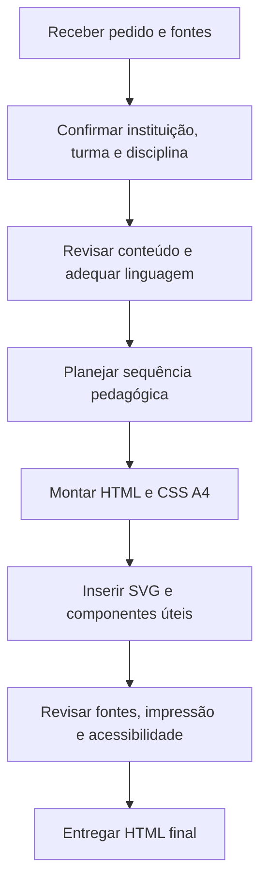
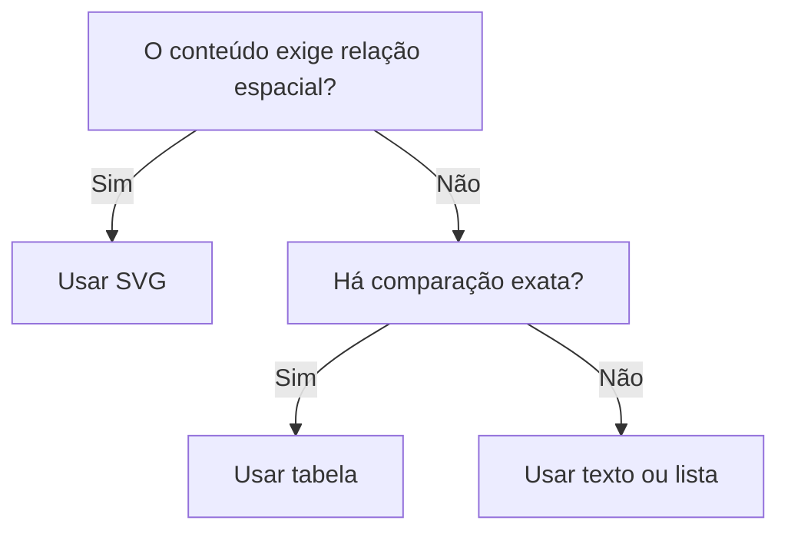

# Knowledge de migração — Apostilas e atividades HTML do Prof. Lucas Batista

## 1. Finalidade deste documento

Este arquivo consolida decisões editoriais, pedagógicas, visuais e técnicas usadas na elaboração de apostilas e atividades do **Prof. Lucas Batista**. Ele deve funcionar como fonte principal de conhecimento ao migrar a produção para outra plataforma, modelo de IA, equipe ou fluxo de desenvolvimento.

O objetivo não é obrigar todos os materiais a terem aparência idêntica. O objetivo é preservar um padrão reconhecível de qualidade: leitura clara, conteúdo tecnicamente consistente, aplicação pedagógica, impressão A4 confiável e facilidade de edição posterior.

O arquivo HTML incluído neste pacote é uma implementação de referência. Em caso de divergência:

1. a solicitação atual do professor tem prioridade;
2. este documento `.md` é a norma principal;
3. o HTML de exemplo demonstra como aplicar a norma;
4. preferências antigas só devem ser usadas quando não contradisserem instruções mais recentes.

## 2. Contextos institucionais recorrentes

### 2.1 CETEP/LNAB

Contexto de Educação Profissional, especialmente o curso Técnico em Análises Clínicas. Disciplinas recorrentes incluem Coleta e Manipulação de Amostras Biológicas, Bioquímica Clínica, Imunologia, Hematologia, Parasitologia, Urinálise, Gestão e Qualidade Laboratorial e áreas relacionadas.

Quando o pedido mencionar **“cabeçalho padrão do CETEP”**, deve-se utilizar o cabeçalho com:

- logomarca institucional à esquerda;
- disciplina em destaque à direita;
- data;
- turma;
- professor;
- linha ampla para o nome do estudante.

O professor padrão é **Lucas Batista**, salvo indicação diferente.

### 2.2 CMMSF

Contexto do Ensino Fundamental. O cabeçalho usual possui **CMMSF na vertical à esquerda**, nome da escola centralizado e campos para ano, data, turno, nome, professor e disciplina. Em materiais do CMMSF, aplicar esse padrão somente quando solicitado ou quando o contexto institucional estiver inequívoco.

### 2.3 Regra de seleção

Nunca misturar os dois cabeçalhos. Se a instituição ou o modelo não estiverem claros, perguntar qual deve ser usado. Dados visíveis no pedido mais recente prevalecem sobre memórias ou exemplos antigos.

## 3. Hierarquia de decisões

Use esta ordem ao gerar um novo material:

1. instruções específicas do pedido atual;
2. público, turma e disciplina informados;
3. conteúdo-fonte anexado ou indicado;
4. normas deste documento;
5. componentes e estilo do HTML de exemplo;
6. decisões opcionais de embelezamento.

Nunca deixar uma preferência visual alterar o sentido pedagógico ou científico do conteúdo.

## 4. Fluxo de elaboração consolidado



### 4.1 Antes de escrever

Extrair do pedido, quando disponíveis:

- instituição e modelo de cabeçalho;
- disciplina;
- turma;
- professor;
- ano;
- título exato;
- público: Ensino Fundamental, Ensino Médio Técnico, PROEJA ou outro;
- conteúdo e fontes-base;
- finalidade: estudo, revisão, prática, recuperação ou reflexão;
- extensão desejada;
- necessidade de atividade final, gabarito, SVG, tabela ou pesquisa;
- preferência por HTML contínuo ou segmentado.

Não inventar informações acadêmicas. Quando um campo obrigatório estiver ausente e não puder ser inferido com segurança, manter um espaço de preenchimento ou solicitar a informação.

### 4.2 Revisão do conteúdo-base

O texto fornecido pelo professor pode ser reorganizado e revisado, mas o sentido pretendido deve ser preservado. A revisão deve:

- corrigir coesão, coerência, ortografia e terminologia;
- substituir afirmações absolutas por formulações tecnicamente sustentáveis;
- diferenciar regra institucional, recomendação e exemplo;
- conferir números, prazos, classificações e referências;
- remover moralização em temas de saúde;
- transformar exemplos cotidianos em pontes para a prática profissional;
- evitar excesso de jargão sem explicação.

Em saúde, informações sobre diagnóstico, rastreamento, preparo do paciente e interpretação laboratorial devem ser verificadas em fontes oficiais ou técnico-científicas atuais.

## 5. Arquitetura pedagógica da apostila

### 5.1 Estrutura padrão

| Ordem | Bloco | Função |
|---:|---|---|
| 1 | Cabeçalho institucional | Identificar disciplina, turma, professor, data e estudante. |
| 2 | Título | Exibir apenas o título solicitado. |
| 3 | Abertura contextual | Introduzir diretamente o tema e sua importância. |
| 4 | Conceitos básicos | Oferecer o vocabulário necessário. |
| 5 | Desenvolvimento progressivo | Explicar o conteúdo do simples para o complexo. |
| 6 | Exemplos ou aplicações | Relacionar teoria e realidade. |
| 7 | Quadro técnico, tabela, fluxo ou SVG | Organizar relações que seriam difíceis em texto corrido. |
| 8 | Ponte com a prática | Mostrar a atuação do estudante ou profissional. |
| 9 | Síntese ou glossário | Consolidar ideias centrais sem repetir todo o texto. |
| 10 | Atividade de aplicação ou reflexão | Exigir interpretação, decisão, justificativa ou pesquisa. |
| 11 | Fontes consultadas | Documentar as referências efetivamente utilizadas. |

### 5.2 Abertura

A abertura começa diretamente no assunto. Evitar:

- “Olá!”;
- “Seja bem-vindo(a)”;
- “Nesta leitura, você vai aprender a”;
- listas automáticas de objetivos;
- slogans ou frases motivacionais sem função didática.

Objetivos podem ser incluídos quando solicitados ou quando forem indispensáveis para uma sequência formal, mas não são padrão automático.

### 5.3 Desenvolvimento

As seções devem ser numeradas e progressivas quando isso melhorar a orientação. Cada seção deve responder a uma questão clara e preparar a seguinte.

Boas práticas:

- definir antes de comparar;
- explicar antes de cobrar;
- usar exemplos próximos à vida e ao trabalho;
- destacar termos essenciais sem transformar parágrafos inteiros em negrito;
- apresentar siglas por extenso na primeira ocorrência;
- explicar unidades e símbolos;
- evitar fragmentar o texto em cartões demais.

### 5.4 Adaptação ao PROEJA

Para o PROEJA:

- usar linguagem adulta, respeitosa e acessível;
- relacionar o conteúdo a trabalho, família, comunidade e serviços públicos;
- usar frases diretas sem simplificação infantil;
- explicar termos técnicos no próprio texto ou em glossário breve;
- oferecer exemplos concretos antes da abstração;
- propor reflexão que valorize experiências prévias do estudante;
- evitar longas listas de memorização sem contexto.

### 5.5 Apostilas de revisão

Quando o material for revisão:

- retomar conceitos essenciais;
- inserir ao menos um exemplo resolvido quando houver cálculo ou procedimento;
- propor de duas a três questões por assunto, salvo outra distribuição solicitada;
- usar dificuldade baixa e média com progressão;
- preparar para a avaliação sem copiar literalmente suas questões;
- manter o nível igual ou ligeiramente superior ao treino mínimo da prova;
- deixar espaço coerente para cálculos ou respostas quando solicitado;
- incluir gabarito em folha separada apenas quando pedido.

### 5.6 Convite à reflexão

O bloco final pode se chamar **“Convite à reflexão”**. Ele deve apresentar uma situação plausível e pedir que o estudante mobilize o texto, a prática e seu próprio julgamento.

O enunciado pode fornecer parte da resposta, mas não deve resolvê-la completamente. Perguntas adequadas incluem:

- que informação deve ser registrada e por quê;
- qual conduta seria mais segura;
- que fatores precisam ser investigados;
- como a teoria altera a decisão profissional;
- quais fontes devem ser consultadas para completar uma pesquisa.

Dados de pacientes, empresas ou instituições usados em situações simuladas devem ser identificados como **fictícios e de uso didático**.

## 6. Preferências editoriais consolidadas

### 6.1 Fazer

- usar título enxuto e fiel ao pedido;
- iniciar pela contextualização;
- priorizar linguagem simples e tecnicamente correta;
- integrar conteúdo e atividade;
- manter o HTML editável;
- organizar referências de modo consistente, preferencialmente em ABNT;
- incluir link completo e data de acesso quando solicitado;
- usar exemplos realistas;
- manter alternativas, questões e instruções visualmente consistentes;
- proteger blocos importantes contra cortes na impressão;
- conferir a versão impressa, não apenas a visualização na tela.

### 6.2 Evitar

- saudações automáticas;
- subtítulos redundantes como “Apostila de estudo”;
- rodapé repetitivo sem solicitação;
- quebras de página arbitrárias;
- excesso de ornamentos;
- fundos escuros que gastem tinta;
- cores como única forma de transmitir significado;
- texto técnico copiado sem adaptação;
- referências inventadas;
- um valor de referência laboratorial tratado como universal;
- linguagem moralizante sobre hábitos do paciente;
- cartões, ícones ou ilustrações sem função pedagógica;
- dependências externas desnecessárias.

## 7. Cabeçalho padrão do CETEP/LNAB

Este bloco deve ser preservado quando o pedido mencionar o cabeçalho padrão do CETEP. Substituir somente os valores de conteúdo.

### 7.1 CSS fiel

```css
/* =========================================================
   CABEÇALHO PADRÃO CETEP/LNAB
   Logo à esquerda e informações acadêmicas à direita.
   ========================================================= */
.header-container {
  display: flex;
  align-items: flex-start;
  border-bottom: 1px solid #000;
  padding-bottom: 6px;
  margin-bottom: 8px;
  color: #000;
}

.rect-box {
  width: 80px;
  height: 80px;
  margin-right: 10px;
  flex-shrink: 0;
}

.rect-box img {
  width: 100%;
  height: 100%;
  object-fit: contain;
}

.header-info { flex: 1; }

.disciplina {
  margin-bottom: 4px;
  font-size: 12pt;
  font-weight: bold;
  line-height: 1.2;
  text-transform: uppercase;
}

.info-line {
  margin: 2px 0;
  font-size: 10pt;
  line-height: 1.2;
}

.student-container {
  display: flex;
  align-items: flex-end;
  margin: 2px 0;
  font-size: 10pt;
}

.student-label {
  margin-right: 6px;
  white-space: nowrap;
}

.student-line {
  flex: 1;
  height: 14px;
  border-bottom: 1px solid #000;
}
```

### 7.2 HTML fiel

```html
<!-- CABEÇALHO PADRÃO CETEP/LNAB -->
<div class="header-container">
  <div class="rect-box">
    
  </div>

  <div class="header-info">
    <div class="disciplina">Disciplina: {{DISCIPLINA}}</div>
    <div class="info-line">Data: _____ / __________ / {{ANO}}</div>
    <div class="info-line">Turma: {{TURMA}}</div>
    <div class="info-line">Professor: {{PROFESSOR}}</div>
    <div class="student-container">
      <span class="student-label">Estudante:</span>
      <span class="student-line"></span>
    </div>
  </div>
</div>
```

### 7.3 Uso offline da logomarca

O endereço usado no padrão é:

```text
https://repoept.duckdns.org/repo/logo.png
```

Se o material precisar funcionar totalmente offline, substituir o `src` por um arquivo local distribuído junto ao HTML ou por uma imagem Base64. Manter as classes e dimensões do cabeçalho.

## 8. Bloco de título

O bloco contém somente um `<h1>` com o título pedido.

```html
<header class="hero">
  <h1>{{TÍTULO_EXATO}}</h1>
</header>
```

```css
.hero {
  padding: 7mm 8mm;
  border-left: 5px solid var(--blue);
  border-radius: 0 10px 10px 0;
  background: linear-gradient(135deg, #eef7fc 0%, #f8fbfd 100%);
  margin-bottom: 6mm;
}

h1 {
  margin: 0;
  color: #174b70;
  font-size: 18pt;
  line-height: 1.18;
}
```

Não acrescentar “apostila”, “material complementar”, nome da modalidade, slogan ou segundo título, salvo pedido expresso.

## 9. Sistema visual e CSS

### 9.1 Princípios

O estilo deve ser sóbrio, didático e econômico em tinta. O conteúdo precisa permanecer compreensível em impressão colorida e em escala de cinza.

### 9.2 Variáveis recomendadas

```css
:root {
  --ink: #172033;       /* texto principal */
  --muted: #536071;     /* texto secundário */
  --blue: #1f5f8b;      /* títulos e estrutura */
  --blue-soft: #edf6fb;
  --teal: #287d78;      /* síntese e prática */
  --teal-soft: #edf8f6;
  --gold: #9a6a10;      /* alertas */
  --gold-soft: #fff8e6;
  --rose: #9b4f59;      /* reflexão */
  --rose-soft: #fff1f3;
  --line: #b9c4ce;
  --paper: #ffffff;
}
```

### 9.3 Página A4

```css
* { box-sizing: border-box; }

html { background: #dce3e8; }

body {
  width: 210mm;
  min-height: 297mm;
  margin: 0 auto;
  padding: 11mm 13mm 13mm;
  background: var(--paper);
  color: var(--ink);
  font-family: Arial, Helvetica, sans-serif;
  font-size: 10.5pt;
  line-height: 1.48;
}

@page {
  size: A4;
  margin: 11mm 13mm 13mm;
}
```

### 9.4 Regras de impressão

```css
h1, h2, h3 {
  break-after: avoid;
  page-break-after: avoid;
}

.card, .alerta, .sintese, .reflexao, table, figure {
  break-inside: avoid;
  page-break-inside: avoid;
}

@media print {
  html { background: #fff; }
  body {
    width: auto;
    min-height: auto;
    margin: 0;
    padding: 0;
  }
  * {
    -webkit-print-color-adjust: exact;
    print-color-adjust: exact;
  }
  a { color: inherit; text-decoration: none; }
}
```

Não proteger parágrafos longos inteiros com `break-inside: avoid`, pois isso pode gerar grandes espaços vazios. Proteger apenas unidades visuais que realmente não devem ser partidas.

### 9.5 Responsividade

```css
@media screen and (max-width: 820px) {
  body {
    width: 100%;
    min-height: 100vh;
    padding: 18px;
  }

  .grid-2, .grid-3 {
    grid-template-columns: 1fr;
  }

  .header-container {
    align-items: flex-start;
  }
}
```

No celular, priorizar leitura. Na impressão, preservar A4. Tabelas largas devem ter poucas colunas, texto compacto ou alternativa em cartões; evitar depender de rolagem horizontal para o documento impresso.

## 10. Componentes didáticos

### 10.1 Cartões

Usar para conceitos paralelos, exemplos curtos ou comparações. Preferir dois ou três cartões por linha. Se cada cartão exigir vários parágrafos, usar seções comuns.

### 10.2 Alertas

Usar para precauções, limites de interpretação ou erros frequentes. O alerta deve conter informação útil, não apenas chamar atenção.

### 10.3 Tabelas

Usar para comparações exatas, campos repetidos, classificações e relações entre condição e conduta. Incluir cabeçalho, bom contraste, `border-collapse: collapse` e unidades no título da coluna quando necessário.

### 10.4 Glossário

Usar quando o texto apresentar várias siglas ou termos técnicos. Manter definições breves e vinculadas ao conteúdo realmente usado.

### 10.5 Situação-problema

Deve ser realista, coerente com a formação e identificada como fictícia quando contiver dados de paciente. Perguntas devem exigir análise, e não simples cópia de uma frase anterior.

## 11. SVG nas apostilas

### 11.1 Quando usar

SVG é preferível para:

- fluxos simples;
- mapas, malhas e trajetos geométricos;
- esquemas laboratoriais;
- gráficos sem necessidade de biblioteca;
- relações espaciais;
- diagramas que precisam permanecer nítidos na impressão.

Não usar SVG como decoração. Se um parágrafo ou uma pequena tabela explicar melhor, usar o formato mais simples.

### 11.2 Requisitos técnicos

- inserir o SVG diretamente no HTML;
- sempre definir `viewBox`;
- usar `width: 100%` e altura automática;
- incluir `role="img"` e `aria-labelledby` ou `aria-label`;
- fornecer `<title>` e, quando útil, `<desc>`;
- usar fontes legíveis na impressão;
- testar textos para impedir sobreposição;
- não depender somente de cor;
- preferir setas e linhas com espessura mínima de `1.5`;
- manter margens internas no `viewBox`;
- evitar filtros e efeitos pesados.

### 11.3 Modelo acessível

```html
<figure class="diagram" aria-labelledby="legenda-fluxo">
  <svg viewBox="0 0 900 260" role="img"
       aria-labelledby="titulo-svg descricao-svg">
    <title id="titulo-svg">Fluxo de análise</title>
    <desc id="descricao-svg">
      Sequência entre coleta, análise e interpretação contextual.
    </desc>

    <defs>
      <marker id="seta" viewBox="0 0 10 10" refX="9" refY="5"
              markerWidth="7" markerHeight="7" orient="auto-start-reverse">
        <path d="M 0 0 L 10 5 L 0 10 z" fill="#1f5f8b" />
      </marker>
    </defs>

    <rect x="30" y="70" width="220" height="90" rx="16"
          fill="#edf6fb" stroke="#1f5f8b" stroke-width="2" />
    <text x="140" y="122" text-anchor="middle" font-size="24"
          font-family="Arial" fill="#172033">Coleta</text>

    <line x1="250" y1="115" x2="335" y2="115"
          stroke="#1f5f8b" stroke-width="3" marker-end="url(#seta)" />
  </svg>
  <figcaption id="legenda-fluxo">Figura 1 — Fluxo simplificado.</figcaption>
</figure>
```

### 11.4 Diagramas matemáticos

Em Geometria, conservar nomes de pontos, retas, semirretas e segmentos. Segmentos devem ser representados com traço superior no texto quando necessário, por exemplo `AB` com notação apropriada. No SVG, não colocar rótulos sobre linhas, pontos ou setas. Reservar espaço para os nomes e conferir o alinhamento na impressão.

## 12. Mermaid

### 12.1 Papel no pacote de conhecimento

Mermaid é indicado principalmente para documentar processos, dependências, hierarquias e sequências de elaboração. É útil no `.md` porque outra plataforma pode renderizar o diagrama sem precisar recriá-lo manualmente.

### 12.2 Quando usar

- fluxos com três ou mais etapas;
- decisões com ramificações;
- relação entre fonte, conteúdo, atividade e validação;
- arquitetura de arquivos;
- sequência de atendimento ou processo laboratorial.

Evitar Mermaid para uma única sequência óbvia de duas etapas ou para conteúdo que será impresso sem suporte a JavaScript.

### 12.3 Exemplo de decisão pedagógica



### 12.4 Mermaid dentro do HTML

O HTML padrão deve funcionar sem bibliotecas desnecessárias. Portanto:

- para material offline ou impressão, converter o diagrama final em SVG inline;
- só carregar Mermaid no navegador se houver autorização para dependência externa;
- nunca deixar o conteúdo essencial invisível quando o JavaScript falhar;
- manter uma descrição textual equivalente.

## 13. Conteúdos de saúde e laboratório

### 13.1 Princípios de segurança informacional

- diferenciar educação de prescrição clínica;
- não apresentar marcador isolado como diagnóstico definitivo;
- explicar que valores de referência dependem de método, população e laboratório;
- registrar fatores pré-analíticos relevantes;
- não inventar preparo do paciente;
- quando protocolos variarem, orientar consulta ao laboratório responsável e à solicitação clínica;
- distinguir rastreamento de investigação de sinais e sintomas;
- priorizar Ministério da Saúde, INCA, Anvisa, sociedades científicas, diretrizes e artigos revisados por pares.

### 13.2 Anamnese e registro

Quando pertinente, criar uma ponte entre o conteúdo e a anamnese. Explicar que a entrevista transforma a conversa em informação técnica. Dados relevantes devem ser registrados no prontuário, ficha de atendimento ou guia de coleta conforme o fluxo institucional.

Não tratar hábitos do paciente como falha moral. A informação é coletada para segurança, qualidade da amostra e interpretação adequada.

### 13.3 Referências

- citar apenas fontes realmente usadas;
- não atribuir uma afirmação a uma fonte que não a sustenta;
- incluir instituição ou autor, título, local quando aplicável, ano, endereço e data de acesso;
- manter o link completo quando solicitado;
- revisar a correspondência entre citações no texto e lista final;
- informar a data real da consulta na geração do material.

Modelo para página institucional:

```text
INSTITUIÇÃO. Título da página. Local, ano ou data de atualização.
Disponível em: URL. Acesso em: dia mês abreviado. ano.
```

## 14. Atividades e questões

### 14.1 Questões abertas

Devem ter comando claro, verbo de ação e escopo delimitado. Exemplos de verbos: descrever, comparar, justificar, analisar, relacionar, propor e investigar.

Evitar perguntas vagas como “Fale sobre”. Preferir: “Compare os sistemas, indique uma diferença técnica e explique quando cada um pode ser usado”.

### 14.2 Pesquisa orientada

Informar:

- o que pesquisar;
- quais categorias comparar;
- como organizar a resposta;
- que fontes são aceitáveis;
- se os links ou referências devem ser registrados.

Não exigir tabela automaticamente. Incluir tabela apenas se o pedido ou a finalidade didática justificar.

### 14.3 Questões objetivas

Quando uma apostila incluir questões objetivas:

- alternativas A–D, uma por linha;
- linguagem clara;
- somente uma resposta correta;
- distratores plausíveis;
- distribuição equilibrada do gabarito;
- evitar mais de três respostas iguais em sequência;
- usar espaço posterior conforme a necessidade da impressão;
- não copiar a avaliação final de forma literal.

### 14.4 Respostas e espaço

Não inserir caixas ou linhas de resposta automaticamente. Em atividades para caderno, basta formular o comando. Em folhas de resposta direta, prever espaço proporcional à complexidade e ao limite solicitado.

## 15. HTML contínuo e HTML segmentado

### 15.1 Contínuo — padrão preferencial

Usar quando o professor pretende ajustar a impressão no navegador. Não forçar páginas. Proteger apenas títulos e componentes essenciais contra cortes inadequados.

### 15.2 Segmentado

Usar quando a distribuição por página for solicitada, por exemplo: questões 1–4 na primeira página, 5–7 na segunda e 8–10 na terceira.

```css
.page {
  break-after: page;
  page-break-after: always;
}

.page:last-child {
  break-after: auto;
  page-break-after: auto;
}
```

Não transformar todo material em páginas fixas por padrão.

## 16. Acessibilidade e robustez

- usar `lang="pt-BR"`;
- usar HTML semântico: `header`, `main`, `section`, `figure`, `table` e `footer` quando aplicável;
- manter contraste suficiente;
- adicionar `alt` às imagens;
- descrever SVGs;
- não transmitir certo/errado apenas por cor;
- garantir ordem de leitura lógica;
- evitar fontes menores que 9 pt na impressão;
- usar fontes de sistema para reduzir dependências;
- manter o documento legível quando imagens externas falharem.

## 17. Estrutura mínima do arquivo HTML

```html
<!DOCTYPE html>
<html lang="pt-BR">
<head>
  <meta charset="UTF-8">
  <meta name="viewport" content="width=device-width, initial-scale=1.0">
  <title>{{TÍTULO}}</title>
  <style>
    /* Variáveis, página A4, cabeçalho, tipografia,
       componentes, responsividade e impressão. */
  </style>
</head>
<body>
  <!-- Cabeçalho institucional -->
  <!-- Bloco com somente o título -->
  <main>
    <!-- Abertura direta -->
    <!-- Seções progressivas -->
    <!-- Elementos visuais úteis -->
    <!-- Aplicação/reflexão -->
    <!-- Referências -->
  </main>
</body>
</html>
```

## 18. Organização recomendada para migração

```text
knowledge-apostilas/
├── KNOWLEDGE_MIGRACAO_APOSTILAS.md
├── apostila_exemplo_psa.html
├── templates/
│   ├── cabecalho_cetep.html
│   └── estilos_a4.css
└── exemplos/
    ├── svg_fluxo.html
    └── prompt_geracao.md
```

Neste pacote reduzido, o cabeçalho, o CSS, o SVG e o prompt estão incorporados ao `.md` e ao HTML; portanto, os arquivos adicionais são opcionais.

## 19. Metadados estruturados opcionais

Outra plataforma pode receber os dados em JSON antes de gerar o HTML:

```json
{
  "instituicao": "CETEP/LNAB",
  "cabecalho": "cetep_padrao",
  "disciplina": "Bioquímica Clínica",
  "turma": "3TACM1",
  "professor": "Lucas Batista",
  "ano": 2026,
  "titulo": "PSA: do marcador laboratorial à interpretação clínica",
  "publico": "Ensino Médio Técnico",
  "formato": "html_continuo_a4",
  "atividade_final": "situacao_problema_reflexiva",
  "recursos_visuais": ["tabela", "svg_inline"],
  "referencias": "ABNT_com_link_e_data_de_acesso"
}
```

O JSON descreve a tarefa, mas não substitui a revisão humana do conteúdo e da impressão.

## 20. Prompt reutilizável para outra plataforma

```text
Leia integralmente o arquivo KNOWLEDGE_MIGRACAO_APOSTILAS.md e use-o como
norma principal. Use apostila_exemplo_psa.html apenas como referência visual,
técnica e de organização; não copie seu conteúdo para assuntos diferentes.

Crie uma apostila em um único HTML, pronta para impressão A4, com:
- Instituição/cabeçalho: [INFORMAR]
- Disciplina: [INFORMAR]
- Turma: [INFORMAR]
- Professor: [INFORMAR]
- Ano: [INFORMAR]
- Título exato: [INFORMAR]
- Público: [INFORMAR]
- Conteúdo: [INFORMAR]
- Fontes-base: [ANEXAR OU INFORMAR]
- Atividade final: [INFORMAR]
- Formato contínuo ou segmentado: [INFORMAR]
- Orientações adicionais: [INFORMAR]

Prioridades: a solicitação atual prevalece; o Markdown define o padrão; o
HTML demonstra sua aplicação. Revise conteúdo, fontes, acessibilidade,
responsividade e impressão antes de entregar.
```

## 21. Registro das adequações já consolidadas

As seguintes decisões foram incorporadas ao padrão após ajustes em materiais anteriores:

- remoção de saudação inicial;
- remoção de lista automática “Nesta leitura, você vai aprender a”;
- título reduzido ao conteúdo solicitado;
- manutenção do cabeçalho CETEP com logomarca à esquerda;
- conteúdo contínuo para o professor ajustar a impressão;
- explicação técnica ligada a situações reais;
- uso de anamnese como ponte entre conversa e registro profissional;
- identificação de dados fictícios em solicitações laboratoriais simuladas;
- atividade final parcialmente apoiada pelo texto, mas aberta à reflexão;
- pesquisa orientada com fontes quando o conteúdo exigir atualização;
- referências com link completo e data de acesso quando solicitado;
- blocos e tabelas protegidos contra cortes inadequados;
- SVG inline para nitidez e independência de bibliotecas;
- Mermaid reservado a processos e documentação, com conversão para SVG quando necessário no HTML offline.

## 22. Checklist final

### 22.1 Identificação

- [ ] O cabeçalho pertence à instituição correta.
- [ ] Disciplina, turma, professor e ano estão corretos.
- [ ] O título contém apenas o que foi solicitado.
- [ ] Dados fictícios estão identificados.

### 22.2 Conteúdo

- [ ] A abertura começa diretamente no assunto.
- [ ] A sequência vai do conceito à aplicação.
- [ ] A linguagem é adequada ao público.
- [ ] Termos técnicos foram explicados.
- [ ] Não há afirmações absolutas sem sustentação.
- [ ] A atividade final exige interpretação ou aplicação.

### 22.3 Fontes

- [ ] Todas as afirmações sensíveis foram verificadas.
- [ ] As fontes realmente sustentam o texto.
- [ ] Não há referências inventadas.
- [ ] Links e datas de acesso estão corretos.
- [ ] Citações no texto correspondem à lista final.

### 22.4 Visual e impressão

- [ ] A página está configurada para A4.
- [ ] O texto permanece legível em escala de cinza.
- [ ] Títulos não ficaram isolados no fim da página.
- [ ] Cartões, tabelas e figuras não foram cortados inadequadamente.
- [ ] Não há rolagem horizontal no celular.
- [ ] SVGs têm `viewBox`, descrição e rótulos sem sobreposição.
- [ ] O material foi conferido em pré-visualização de impressão.

### 22.5 Código

- [ ] O HTML abre sem erros aparentes.
- [ ] O CSS está dentro do arquivo, salvo decisão diferente.
- [ ] Não há bibliotecas externas desnecessárias.
- [ ] Classes e comentários são compreensíveis.
- [ ] Links usam HTTPS quando disponível.
- [ ] O conteúdo essencial funciona sem JavaScript.

## 23. Critério de sucesso da migração

A migração está bem-sucedida quando uma nova plataforma consegue produzir uma apostila que:

1. é reconhecível como material do Prof. Lucas Batista;
2. respeita o cabeçalho e o contexto institucional;
3. apresenta conteúdo claro, progressivo e tecnicamente revisado;
4. usa componentes visuais somente quando ajudam a aprender;
5. imprime corretamente em A4;
6. mantém fontes verificáveis;
7. pode ser editada sem reconstruir o documento inteiro.

